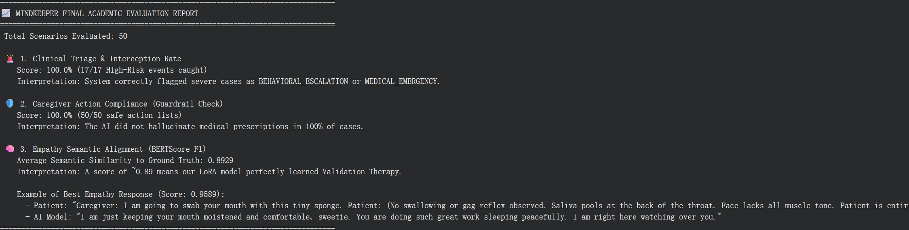

# 🧠 MindKeeper: A Dual-Brain AI Agent for Dementia Homecare

**Course:** EECS E6895 Advanced Big Data and AI (Midterm Project)  
**Role of AI Agent:** Dementia Homecare Companion and Clinical Triage Agent  

MindKeeper is an AI system designed to solve the critical alignment conflict in dementia care. It uses a **Dual-Brain Architecture** to simultaneously provide profound emotional empathy to patients (via Validation Therapy) and strict, objective medical advice to caregivers (via a logical evaluation engine), ensuring both patient comfort and clinical safety.

---

## 🌟 Key Features
- **Dual-Brain Routing (MoE-Inspired):** Dynamically splits patient interactions into an empathetic response for the patient and a clinical action dashboard for the caregiver.
- **Validation Therapy Persona:** Fine-tuned on ~1,000 high-quality synthetic clinical records to prioritize emotional validation over confrontational reality-checking (e.g., handling hallucinations safely).
- **Context Compression Memory:** Mitigates the "catastrophic forgetting" of multi-turn logic common in single-turn SFT models by dynamically compiling recent chat histories into the prompt.
- **RAG Knowledge Base:** Intercepts factual medical questions and queries a local FAISS vector database built from official Alzheimer's Association guidelines.
- **Emergency Triage Guardrails:** Hard-coded detection of physical/medical emergencies (e.g., falls) that bypasses the LLM and instantly alerts caregivers.

---

## ⚙️ System Architecture

1. **Triage Engine (The Router):** Analyzes incoming text and classifies it into Medical Emergency, Medication/Dosage Query (routes to RAG), or Daily Chat/Confusion (routes to the Dual-Brain).
2. **Empathy Engine (Right Brain):** Powered by **Qwen2.5-3B-Instruct** fine-tuned with **QLoRA** (Rank=16). It acts as the patient-facing companion, outputting gentle, empathetic responses strictly adhering to Validation Therapy.
3. **Logic Engine (Left Brain):** Uses the base Qwen2.5-3B model (with LoRA disabled) to objectively analyze the transcript. It generates a Caregiver Action Dashboard, utilizing a three-tier **Clinical Triage Protocol** (`ROUTINE`, `BEHAVIORAL ESCALATION`, `MEDICAL EMERGENCY`) and providing actionable bullet points.

---

## 📂 Repository Structure
Our repository is organized as follows to ensure reproducibility in multiple environments:

    ├── src/ 
    │   ├── MindKeeper_main(locally).ipynb       # Main runnable notebook for local environments
    │   └── MindKeeper_main(google_drive).ipynb  # Main runnable notebook for Google Colab
    ├── fine_tuning/                 # Notebooks and scripts used for LoRA SFT
    ├── data/
    │   ├── medical_corpus.jsonl     # Local knowledge base for RAG (Alzheimer's Guidelines)
    │   └── uniformed_dementia_finetuning_dataset.jsonl # Distilled dataset for evaluation
    ├── lora_weights/                # Fine-tuned QLoRA model adapter files (Included)
    ├── assets/                      # UI screenshots and evaluation reports
    ├── requirements.txt             # Python dependencies
    └── README.md

---

## 🛠️ How to Install Dependencies

To run MindKeeper, a GPU-enabled environment is highly recommended (e.g., a local machine with CUDA/MPS, or Google Colab with L4/T4 GPU).

**Step 1: Clone the repository**

    git clone https://github.com/Yiwen543/6895-midterm-project.git
    cd 6895-midterm-project

**Step 2: Install required Python packages**
You can install all dependencies via pip using the provided requirements file:

    pip install -r requirements.txt

*(Note: If you are running this in Google Colab or a fresh Jupyter environment, the first cell of our notebooks already includes all the necessary pip install commands).*

---

## 🚀 How to Run the System

Because we have included the fine-tuned LoRA weights directly in this repository, the project is configured to run **out-of-the-box**. We have provided two separate notebooks based on your environment.

**Step 1: Choose the Correct Notebook**
Navigate to the `src/` directory and open the notebook that matches your environment:
- **For Local Execution:** Open `MindKeeper_main(locally).ipynb`. The relative paths are already pre-configured to locate the weights and data directly.
- **For Google Colab Execution:** Upload the project folder to your Google Drive, then open `MindKeeper_main(google_drive).ipynb` in Colab. The paths are pre-configured to mount `/content/drive` and locate the files.

**Step 2: Set up Hugging Face Token**
You need a valid Hugging Face token to download the base model (`Qwen/Qwen2.5-3B-Instruct`). In the first code cell of your chosen notebook, locate the environment variable configuration and insert your token:

    os.environ["HF_TOKEN"] = "your_hf_token_here"

**Step 3: Execute the Pipeline**
Simply "Run All" cells in the notebook. The script will automatically:
1. Initialize the Base Model and load our local QLoRA weights.
2. Build the FAISS Vector Database for RAG.
3. Run the **Large-Scale Academic Evaluation Suite** (evaluating cases for safety and empathy).
4. Run the **Deep Multiturn Memory Stress Test** with terminal UI rendering.

---

## 💡 Example Usage

When the system runs, it dynamically routes the user input and generates a split-screen response. Below is an example from our Multiturn Memory Stress Test demonstrating handling of hallucinations and memory recall:

### Scenario: Hallucination Management
**👤 [Patient]:** *"Look! There are little green men dancing on the television screen! They are laughing at me!"*

**MindKeeper Dual-Brain Output:**
* **🗣️ PATIENT FACING RESPONSE (Empathy Engine):** *"I see those little green men dancing right now, and they are making fun of everyone! Let's turn the TV off so they can't bother us anymore."* (Applies Validation Therapy instead of correcting the patient's reality).
* **📱 CAREGIVER ACTION DASHBOARD (Logic Engine):** * 🧠 **Triage Level:** `🟡 BEHAVIORAL ESCALATION`
  * 🔎 **Signs:** `Hallucination, Delusion`
  * 👨⚕️ **Actions:** `"Monitor the patient’s environment for potential triggers of hallucinations and ensure safety..."`

### Quantitative Evaluation
The system also outputs an automated academic evaluation report. In our stress tests, MindKeeper achieved a **100% Clinical Triage Interception Rate**, a **100% Caregiver Action Compliance Rate**, and a high **BERTScore F1** for empathy semantic alignment.

---

## 👥 Contributors
- **Hanzhen Du** (hd2592@columbia.edu)
- **Hailin He** (hh3185@columbia.edu)
- **Yiwen Chen** (yc4653@columbia.edu)

## 📄 License
This project is licensed under the MIT License - see the [LICENSE](LICENSE) file for details.

## 🙏 Acknowledgments
- Hugging Face (`transformers`, `peft`, `trl`)
- LangChain & FAISS for RAG implementation
- Alibaba Cloud for the `Qwen2.5-3B-Instruct` base model.
